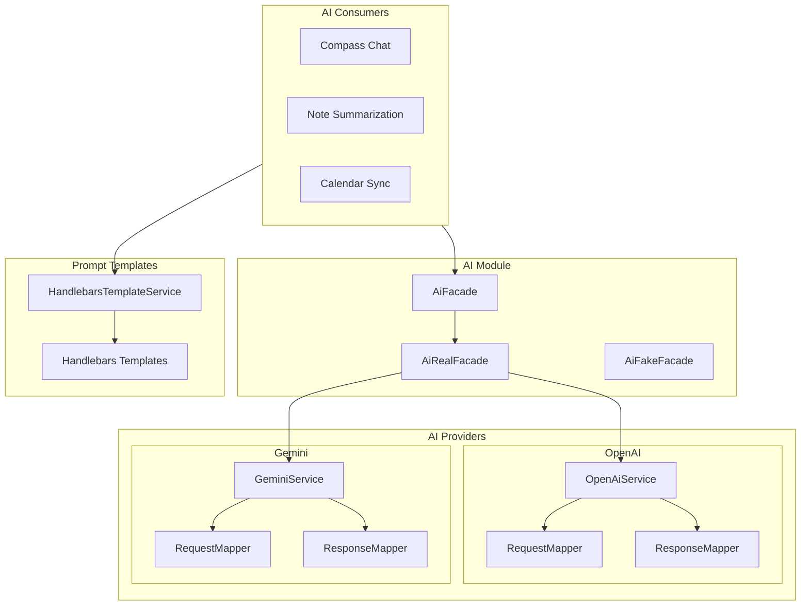
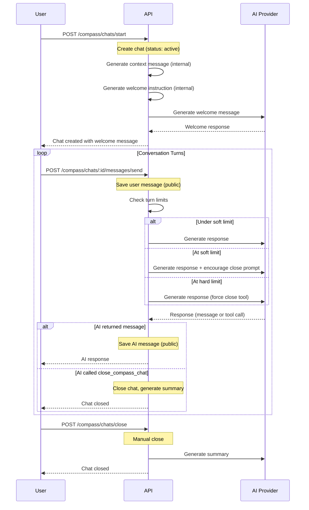

# AI Integration

The application uses AI extensively for the Compass chat, note summarization, and calendar event syncing. The AI layer is provider-agnostic, with a unified interface abstracting OpenAI and Google Gemini.

## Architecture



---

## AI Service Layer

### AiFacade (`src/ai/ai.facade.ts`)

The abstract facade that all consumers depend on:

```typescript
abstract class AiFacade {
  abstract generate(params: AiGenerateFacadeParams): Promise<AiGenerateData>;
}
```

**`AiGenerateFacadeParams`** extends the base params with optional `provider` and `model`:

| Field | Type | Default | Description |
|-------|------|---------|-------------|
| `provider` | enum | `Gemini` | AI provider to use (`OpenAI` or `Gemini`) |
| `model` | string | `gemini-2.5-flash` | Model identifier |
| `messages` | array | required | Conversation messages |
| `tools` | array | optional | Available tool/function definitions |
| `reasoning` | enum | `Low` | Reasoning effort level |
| `temperature` | number | optional | Sampling temperature |
| `toolSelectionMode` | enum | optional | Tool selection behavior |
| `responseFormat` | object | optional | Structured response format |

### AiRealFacade (`src/ai/ai-real.facade.ts`)

Production implementation that routes requests to the appropriate provider:

- **Default provider**: Gemini
- **Default model**: `gemini-2.5-flash`
- **Default reasoning**: `Low`

### AiFakeFacade (`src/ai/ai-fake.facade.ts`)

Test double with mockable behavior:

- `mockGenerateResolvedValue(data)` -- Mock a fixed response
- `mockGenerateImplementation(fn)` -- Mock with custom logic
- `clearGenerateMocks()` -- Reset mocks

---

## AI Providers

### Base Service (`src/ai/base/services/ai.service.ts`)

Abstract class that both providers extend:

1. Receives unified `AiGenerateParams`
2. Merges sequential messages with the same role (via `AiHelper`)
3. Maps request through provider-specific `RequestMapper`
4. Makes HTTP POST to the provider API
5. Maps response through provider-specific `ResponseMapper`
6. Returns unified `AiGenerateData`

### OpenAI (`src/ai/open-ai/`)

- **API URL**: `https://api.openai.com/v1/chat/completions`
- **API Key**: From `ConfigProvider.ai.openAiKey`

**Request Mapping:**

| Unified Field | OpenAI Field |
|---------------|-------------|
| `model` | `model` |
| `messages` | `input[]` |
| `tools` | `tools[]` |
| `reasoning` | `reasoning` (None->Minimal, Low->Low, Medium->Medium, High->High) |
| `toolSelectionMode` | `tool_choice` (AnyCallRequired->Required, AllCallsOptional->Auto) |
| `responseFormat` | `text` |
| `temperature` | `temperature` |

**Response Mapping:**

Handles output types: `Message`, `FunctionCall`, `Reasoning`, `WebSearchCall`

### Gemini (`src/ai/gemini/`)

- **API URL**: `https://generativelanguage.googleapis.com/v1beta/openai/chat/completions`
- **API Key**: From `ConfigProvider.ai.geminiKey`

**Request Mapping:**

| Unified Field | Gemini Field |
|---------------|-------------|
| `model` | `model` |
| `messages` | `messages[]` |
| `tools` | `tools[]` |
| `reasoning` | `reasoning_effort` (None->None, Low->Low, Medium->Medium, High->High) |
| `toolSelectionMode` | `tool_choice` (AnyCallRequired->Required, AllCallsOptional->Auto) |
| `temperature` | `temperature` |

**Response Mapping:**

Handles `choices[]` array with content messages and tool call function messages.

### Unified Response Format

```typescript
interface AiGenerateData {
  message?: string;       // Text content from the AI
  actions?: AiAction[];   // Tool/function call results
}

interface AiAction {
  name: string;           // Function name
  arguments: object;      // Parsed arguments
}
```

---

## Prompt Templates

Prompts are defined as **Handlebars** (`.hbs`) templates in the `prompts/` directory. The `HandlebarsTemplateService` (`src/lib/template/`) compiles templates with context data.

### Compass Chat Prompts

#### `compass-context.hbs`

The main system prompt that defines the AI Compass persona. This is the most important template -- it shapes the entire Compass experience.

Key sections:
- **Archetype definition** based on user belief system:
  - Thai Buddhism, Chinese Buddhism, Islam, Christianity, Hinduism, Other
- **User context injection**: recent chat summaries, note summaries, paths
- **Core philosophy**: "Enough for Today" -- emotion-first, minimalist guidance
- **Conversation flow**: Acknowledge -> Offer Choice -> Practice -> Reflection -> Celebration -> Farewell

#### `compass-welcome-instruction.hbs`

Welcome message template with topic-specific partials:
- `open-question` -- Open-ended conversation starter
- `personal-note` -- Discussion based on a user's note
- `path-item` -- Guidance about a specific path/goal
- `calendar-event` -- Discussion about a calendar event
- `quote` -- Reflection on the daily quote

#### `compass-conversation.hbs`

Conversation continuation prompt (currently minimal/empty).

#### `compass-chat-close-function-description.hbs`

Describes the `close_compass_chat` AI tool/function:
- When to call: goal achieved AND no further questions
- Includes examples and constraints for the AI

#### `compass-chat-encourage-close.hbs`

System message injected when approaching the soft turn limit:
- Encourages the user to summarize or decide next steps
- Does not force closure

#### `compass-summarize.hbs`

Template for generating conversation summaries after a chat closes:
- Produces an impersonal summary in the user's language
- Captures the core topic and outcome

### Note Prompts

#### `note-summarize.hbs`

Summarizes personal notes for use as context in future conversations:
- Includes title, description, mood, timestamps
- Focuses on extracting the core idea and emotional state

### Compass Tool Prompts

#### `compass-suggest-add-path-function-description.hbs`

Describes the `suggest_add_path` AI tool/function:
- Used when the AI suggests the user add a new path/goal
- Includes the function parameters and constraints

#### `compass-suggest-save-note-function-description.hbs`

Describes the `suggest_save_note` AI tool/function:
- Used when the AI suggests the user save a note
- Includes the function parameters and constraints

### Calendar Prompts (`prompts/calendar/`)

#### `sync-context.hbs`

Context for the calendar sync AI agent:
- Role: creating and updating holiday calendars
- Handles government holidays and spiritual/religious events

#### `sync-instruction.hbs`

Instructions for calendar event generation:
- Variables: `beliefSystem`, `syncStartDate`, `syncEndDate`
- Uses Thai timezone for date calculations

---

## Compass Chat Flow

The Compass is the core AI feature -- a turn-based conversational guide that adapts to the user's belief system.



### Turn Management

- A **turn** increments when the active speaker changes from User to System
- **Soft limit** (default: 10 turns): An encouragement message is injected to guide closure
- **Hard limit** (default: 25 turns): The AI is forced to call the `close_compass_chat` tool
- Limits are configurable via `COMPASS_TURNS_COUNT_SOFT_LIMIT` and `COMPASS_TURNS_COUNT_HARD_LIMIT`

### Message Visibility

Messages have two visibility levels:

| Visibility | Description |
|-----------|-------------|
| `public` | Visible to the user in the chat UI |
| `internal` | Only sent to the AI as context (system prompts, instructions) |

### Chat Close Reasons

| Reason | Trigger |
|--------|---------|
| `manual` | User explicitly closes the chat |
| `goal-reached` | AI determines the goal is achieved and calls `close_compass_chat` |
| `limit-reached` | Hard turn limit reached, AI forced to close |

### Post-Close Summary

When a chat closes (for any reason), the `CompassChatClosedEvent` triggers the `CompassChatClosedEventHandler`, which generates an AI summary using the `compass-summarize.hbs` template. This summary is stored in `compass_chats_summaries` and used as context for future chats.

---

## Prompt Injection Sanitization

The `BodyPromptMarkupSanitizerInterceptor` is applied globally to sanitize potential prompt injection attempts in request body strings. It processes all string fields before they reach command handlers.

This can be disabled per-endpoint using the `@DisableBodyPromptInjectionSanitizer()` decorator (used in playground endpoints for testing).

---

## Adding a New AI-Powered Feature

1. Create a Handlebars template in `prompts/` for the system prompt
2. Create a query handler in the `prompt` domain module to load and compile the template
3. In your command handler, inject `AiFacade` and call `generate()` with:
   - The compiled prompt as a system message
   - Any user input as a user message
   - Tool definitions if the AI should call functions
4. Handle the response (text message and/or tool calls)
5. Store the result as needed
