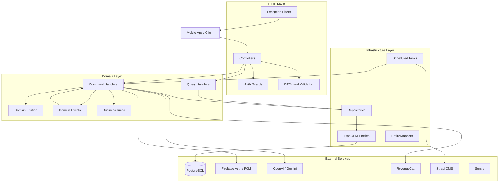
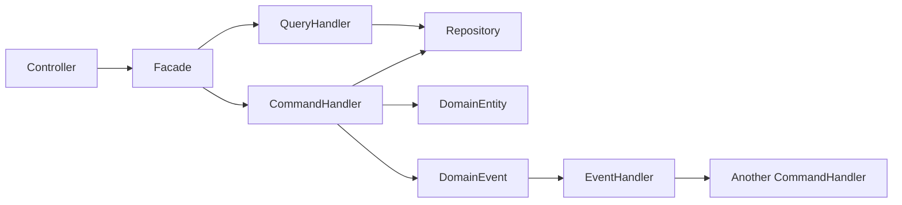
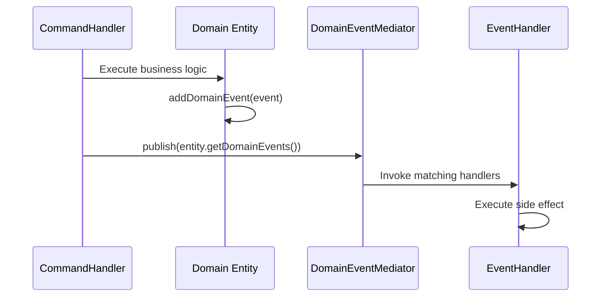
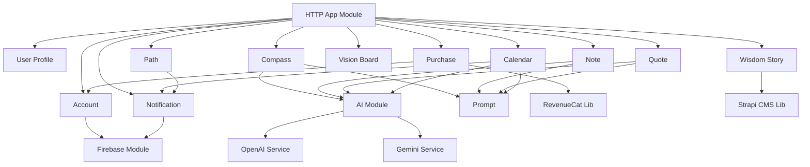

# Architecture

## High-Level Overview

Evolusea Backend follows a **Domain-Driven Design (DDD)** approach with **CQRS** (Command Query Responsibility Segregation) and a layered architecture. The application is built on NestJS and organizes business logic into bounded domain modules.



## Layered Architecture

The codebase is organized into four distinct layers:

### 1. HTTP Layer (`src/http-app/`)

The outermost layer that handles HTTP concerns:

- **Controllers** -- Define REST endpoints, delegate to command/query handlers via domain facades
- **DTOs** -- Request/response data transfer objects with `class-validator` decorations
- **Guards** -- Authentication and authorization (Firebase JWT, account/profile checks, email verification)
- **Filters** -- Exception-to-HTTP-response mapping (domain errors, HTTP exceptions, custom exceptions)
- **Interceptors** -- Cross-cutting concerns (prompt injection sanitization)

### 2. Application Layer (`src/domain/*/application/`)

Orchestrates use cases through CQRS:

- **Command Handlers** -- Write operations that modify state (create, update, delete)
- **Query Handlers** -- Read operations that return data without side effects
- **Domain Event Handlers** -- React to domain events asynchronously (e.g., summarize a note after creation)
- **Facades** -- Abstract interfaces that controllers use to access domain operations

### 3. Domain Layer (`src/domain/*/domain/`)

Pure business logic with no framework dependencies:

- **Domain Entities** -- Rich models with behavior and invariant enforcement
- **Value Objects** -- Immutable objects defined by their attributes
- **Business Rules** -- Encapsulated validation logic (sync and async)
- **Domain Events** -- Notifications of significant domain occurrences

### 4. Infrastructure Layer (`src/domain/*/infrastructure/`)

Technical implementations:

- **TypeORM Entities** -- Database table mappings
- **Repositories** -- Data access implementations
- **Mappers** -- Domain-to-persistence and persistence-to-domain transformations
- **Scheduled Tasks** -- Cron-based background jobs

## CQRS Pattern

Commands and queries are separated into distinct handler interfaces:



**Command Handler** -- Handles write operations, may emit domain events:

```typescript
interface CommandHandler<Command, Result> {
  handle(command: Command, tx?: Transaction): Promise<Result> | Result;
}
```

**Query Handler** -- Handles read operations, returns data:

```typescript
interface QueryHandler<Query, Result> {
  handle(query: Query): Promise<Result> | Result;
}
```

## Building Blocks (`src/building-blocks/`)

Shared abstractions that all domain modules extend:

### Entity Base Class

Abstract base class that manages domain events and tracks timestamps:

- `addDomainEvent(event)` -- Collect events during a use case
- `getDomainEvents()` / `clearDomainEvents()` -- Retrieve and flush pending events
- `checkRule(rule)` / `checkAsyncRule(rule)` -- Enforce business invariants
- `equals(other)` -- Identity-based equality

### Value Object

Immutable objects identified by their properties rather than an ID.

### Business Rules

Encapsulated validation logic:

- `SyncBusinessRule` -- Synchronous rules with `isBroken()` and `getMessage()`
- `AsyncBusinessRule` -- Asynchronous rules (e.g., requiring database lookups)
- Rules throw `DomainRuleViolationError` when violated

### Domain Events and Mediator

The mediator pattern enables decoupled event-driven communication:



- **InMemoryDomainEventMediator** -- In-memory implementation with wildcard event matching
- **@OnDomainEvent(type)** decorator -- Marks methods as event handlers, auto-discovered at module init
- **@Event()** parameter decorator -- Injects the event object into handler methods
- Handlers are registered automatically via NestJS `DiscoveryModule`

## Module Dependency Graph



## Key Design Decisions

1. **DDD with CQRS** -- Separates read and write models for clarity and scalability. Domain entities encapsulate business rules, while infrastructure handles persistence.

2. **Facade Pattern** -- Each domain module exposes an abstract facade that the HTTP layer depends on. This decouples controllers from implementation details and simplifies testing.

3. **Event-Driven Side Effects** -- Operations like note summarization and chat summary generation are triggered by domain events rather than being coupled to the originating command.

4. **AI Provider Abstraction** -- The AI module abstracts away provider-specific details (OpenAI, Gemini) behind a unified facade, making it easy to switch or add providers.

5. **Transaction Management** -- Commands run within transactions where needed, with the transaction context passed through the call chain.

6. **Distributed Locking** -- Database-backed distributed locks prevent concurrent execution of scheduled tasks across multiple instances.
