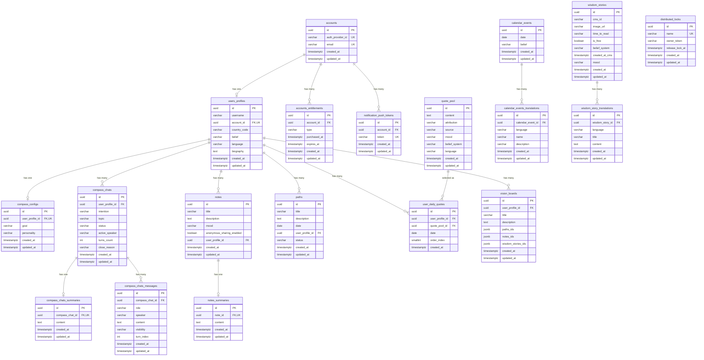

# Database Schema

The application uses **PostgreSQL 16** with **TypeORM 0.3** as the ORM. Table and column names use `snake_case` via the `SnakeNamingStrategy`.

## Entity Relationship Diagram



## Entities

### accounts

Represents an authenticated user account linked to Firebase.

| Column | Type | Constraints | Description |
|--------|------|-------------|-------------|
| `id` | UUID | PK, auto-generated | Primary key |
| `auth_provider_id` | VARCHAR | UNIQUE, NOT NULL | Firebase UID |
| `email` | VARCHAR | UNIQUE, NOT NULL | User email from Firebase |
| `created_at` | TIMESTAMPTZ | NOT NULL | Record creation timestamp |
| `updated_at` | TIMESTAMPTZ | NOT NULL | Last update timestamp |

**Cascade deletes:** UserProfile, AccountEntitlement, NotificationPushToken

---

### users_profiles

User's profile with preferences and demographic information.

| Column | Type | Constraints | Description |
|--------|------|-------------|-------------|
| `id` | UUID | PK, auto-generated | Primary key |
| `username` | VARCHAR | NOT NULL | Display name |
| `account_id` | UUID | FK, UNIQUE, NOT NULL | Reference to `accounts.id` |
| `country_code` | VARCHAR | NOT NULL | Country code enum |
| `belief` | VARCHAR | NOT NULL | Belief system (`chinese-buddhism`, `thai-buddhism`, `christianity`, `hinduism`, `islam`, `other`) |
| `language` | VARCHAR | NOT NULL, default `en` | Language (`en`, `th`, `id`) |
| `biography` | TEXT | NULLABLE | User biography |
| `created_at` | TIMESTAMPTZ | NOT NULL | Record creation timestamp |
| `updated_at` | TIMESTAMPTZ | NOT NULL | Last update timestamp |

**Cascade deletes:** CompassConfig, CompassChat, Note, Path, UserDailyQuote, VisionBoard

---

### accounts_entitlements

Subscription entitlements synced from RevenueCat.

| Column | Type | Constraints | Description |
|--------|------|-------------|-------------|
| `id` | UUID | PK, auto-generated | Primary key |
| `account_id` | UUID | FK, NOT NULL | Reference to `accounts.id` |
| `type` | VARCHAR | NOT NULL | Entitlement type (`premium_access`) |
| `purchased_at` | TIMESTAMPTZ | NOT NULL | Purchase timestamp |
| `expires_at` | TIMESTAMPTZ | NULLABLE | Expiration timestamp (null = lifetime) |
| `created_at` | TIMESTAMPTZ | NOT NULL | Record creation timestamp |
| `updated_at` | TIMESTAMPTZ | NOT NULL | Last update timestamp |

**Unique constraint:** (`account_id`, `type`)

---

### compass_configs

Per-user configuration for the Compass AI chat feature.

| Column | Type | Constraints | Description |
|--------|------|-------------|-------------|
| `id` | UUID | PK, auto-generated | Primary key |
| `user_profile_id` | UUID | FK, UNIQUE, NOT NULL | Reference to `users_profiles.id` |
| `goal` | VARCHAR | NOT NULL | User's goal |
| `personality` | VARCHAR | NOT NULL | Preferred AI personality |
| `created_at` | TIMESTAMPTZ | NOT NULL | Record creation timestamp |
| `updated_at` | TIMESTAMPTZ | NOT NULL | Last update timestamp |

---

### compass_chats

A conversation session between the user and the AI Compass.

| Column | Type | Constraints | Description |
|--------|------|-------------|-------------|
| `id` | UUID | PK, auto-generated | Primary key |
| `user_profile_id` | UUID | FK, NOT NULL, indexed | Reference to `users_profiles.id` |
| `intention` | VARCHAR | NOT NULL | Chat intention enum |
| `topic` | VARCHAR | NOT NULL | Chat topic (`open-question`, `personal-note`, `path-item`, `calendar-event`, `quote`) |
| `status` | VARCHAR | NOT NULL | Chat status (`active`, `closed`) |
| `active_speaker` | VARCHAR | NULLABLE | Current speaker (User or System) |
| `turns_count` | INT | NOT NULL, default `0` | Number of completed turns |
| `close_reason` | VARCHAR | NULLABLE | Close reason (`manual`, `goal-reached`, `limit-reached`) |
| `created_at` | TIMESTAMPTZ | NOT NULL | Record creation timestamp |
| `updated_at` | TIMESTAMPTZ | NOT NULL | Last update timestamp |

**Cascade deletes:** CompassChatSummary, CompassChatMessage

---

### compass_chats_messages

Individual messages within a Compass chat session.

| Column | Type | Constraints | Description |
|--------|------|-------------|-------------|
| `id` | UUID | PK, auto-generated | Primary key |
| `compass_chat_id` | UUID | FK, NOT NULL | Reference to `compass_chats.id` |
| `role` | VARCHAR | NOT NULL | AI role (`User`, `Assistant`, `System`) |
| `speaker` | VARCHAR | NOT NULL | Speaker identity (User or System) |
| `content` | TEXT | NOT NULL | Message content |
| `visibility` | VARCHAR | NOT NULL | Visibility (`public`, `internal`) |
| `turn_index` | INT | NOT NULL | Turn sequence number |
| `created_at` | TIMESTAMPTZ | NOT NULL | Record creation timestamp |
| `updated_at` | TIMESTAMPTZ | NOT NULL | Last update timestamp |

**Composite index:** (`compass_chat_id`, `visibility`)

---

### compass_chats_summaries

AI-generated summary of a closed Compass chat.

| Column | Type | Constraints | Description |
|--------|------|-------------|-------------|
| `id` | UUID | PK, auto-generated | Primary key |
| `compass_chat_id` | UUID | FK, UNIQUE, indexed | Reference to `compass_chats.id` |
| `content` | TEXT | NOT NULL | Summary text |
| `created_at` | TIMESTAMPTZ | NOT NULL | Record creation timestamp |
| `updated_at` | TIMESTAMPTZ | NOT NULL | Last update timestamp |

---

### notes

Personal journal entries with mood tracking.

| Column | Type | Constraints | Description |
|--------|------|-------------|-------------|
| `id` | UUID | PK, auto-generated | Primary key |
| `title` | VARCHAR | NOT NULL | Note title |
| `description` | TEXT | NULLABLE | Note content |
| `mood` | VARCHAR | NOT NULL | Mood (`overwhelmed`, `uncertain`, `calm`, `motivated`) |
| `anonymous_sharing_enabled` | BOOLEAN | NOT NULL, default `false` | Anonymous sharing flag |
| `user_profile_id` | UUID | FK, NOT NULL, indexed | Reference to `users_profiles.id` |
| `created_at` | TIMESTAMPTZ | NOT NULL | Record creation timestamp |
| `updated_at` | TIMESTAMPTZ | NOT NULL | Last update timestamp |

**Cascade deletes:** NoteSummary

---

### notes_summaries

AI-generated summaries for notes.

| Column | Type | Constraints | Description |
|--------|------|-------------|-------------|
| `id` | UUID | PK, auto-generated | Primary key |
| `note_id` | UUID | FK, UNIQUE, indexed | Reference to `notes.id` |
| `content` | TEXT | NOT NULL | Summary text |
| `created_at` | TIMESTAMPTZ | NOT NULL | Record creation timestamp |
| `updated_at` | TIMESTAMPTZ | NOT NULL | Last update timestamp |

---

### paths

Goals and action items with target dates and status tracking.

| Column | Type | Constraints | Description |
|--------|------|-------------|-------------|
| `id` | UUID | PK, auto-generated | Primary key |
| `title` | VARCHAR | NOT NULL | Path title |
| `description` | TEXT | NULLABLE | Path description |
| `date` | DATE | NOT NULL | Target date |
| `user_profile_id` | UUID | FK, NOT NULL, indexed | Reference to `users_profiles.id` |
| `status` | VARCHAR | NOT NULL, default `awaiting` | Status (`awaiting`, `overdue`, `completed`) |
| `created_at` | TIMESTAMPTZ | NOT NULL | Record creation timestamp |
| `updated_at` | TIMESTAMPTZ | NOT NULL | Last update timestamp |

---

### quote_pool

Pre-curated pool of inspirational quotes seeded via migration. No user-specific data -- shared across all users.

| Column | Type | Constraints | Description |
|--------|------|-------------|-------------|
| `id` | UUID | PK, auto-generated | Primary key |
| `content` | TEXT | NOT NULL | Quote text |
| `attribution` | VARCHAR | NOT NULL | Quote author/speaker |
| `source` | VARCHAR | NULLABLE | Source book/talk/text |
| `mood` | VARCHAR | NOT NULL | Mood category (`calm`, `motivated`, `uncertain`, `overwhelmed`, `grateful`, `restless`) |
| `belief_system` | VARCHAR | NOT NULL | Belief system (`chinese-buddhism`, `thai-buddhism`, `christianity`, `hinduism`, `islam`, `other`) |
| `language` | VARCHAR | NOT NULL | Language (`en`, `th`, `id`) |
| `created_at` | TIMESTAMPTZ | NOT NULL | Record creation timestamp |
| `updated_at` | TIMESTAMPTZ | NOT NULL | Last update timestamp |

**Composite index:** (`belief_system`, `mood`, `language`)

---

### user_daily_quotes

Per-user daily quote selections cached from the quote pool.

| Column | Type | Constraints | Description |
|--------|------|-------------|-------------|
| `id` | UUID | PK, auto-generated | Primary key |
| `user_profile_id` | UUID | NOT NULL | Reference to the user profile |
| `quote_pool_id` | UUID | FK, NOT NULL | Reference to `quote_pool.id` |
| `date` | DATE | NOT NULL | Quote date |
| `order_index` | SMALLINT | NOT NULL | Position in the daily quotes list (0, 1, 2) |
| `created_at` | TIMESTAMPTZ | NOT NULL | Record creation timestamp |

**Unique composite index:** (`user_profile_id`, `date`, `order_index`)
**Composite index:** (`user_profile_id`, `date`)

---

### vision_boards

Curated collections referencing paths, notes, and wisdom stories.

| Column | Type | Constraints | Description |
|--------|------|-------------|-------------|
| `id` | UUID | PK, auto-generated | Primary key |
| `user_profile_id` | UUID | FK, NOT NULL, indexed | Reference to `users_profiles.id` |
| `title` | VARCHAR | NOT NULL | Vision board title |
| `description` | TEXT | NULLABLE | Vision board description |
| `paths_ids` | JSONB | NOT NULL, default `[]` | Array of path UUIDs |
| `notes_ids` | JSONB | NOT NULL, default `[]` | Array of note UUIDs |
| `wisdom_stories_ids` | JSONB | NOT NULL, default `[]` | Array of wisdom story UUIDs |
| `created_at` | TIMESTAMPTZ | NOT NULL | Record creation timestamp |
| `updated_at` | TIMESTAMPTZ | NOT NULL | Last update timestamp |

Note: References to paths, notes, and wisdom stories are stored as JSONB arrays, not as foreign keys.

---

### calendar_events

Religious and cultural calendar events.

| Column | Type | Constraints | Description |
|--------|------|-------------|-------------|
| `id` | UUID | PK, auto-generated | Primary key |
| `date` | DATE | NOT NULL | Event date |
| `belief` | VARCHAR | NOT NULL | Belief system |
| `created_at` | TIMESTAMPTZ | NOT NULL | Record creation timestamp |
| `updated_at` | TIMESTAMPTZ | NOT NULL | Last update timestamp |

**Unique composite:** (`date`, `belief`)

---

### calendar_events_translations

Translated content for calendar events.

| Column | Type | Constraints | Description |
|--------|------|-------------|-------------|
| `id` | UUID | PK, auto-generated | Primary key |
| `calendar_event_id` | UUID | FK, NOT NULL | Reference to `calendar_events.id` |
| `language` | VARCHAR | NOT NULL | Language (`en`, `th`, `id`) |
| `name` | VARCHAR | NOT NULL | Event name |
| `description` | VARCHAR | NOT NULL | Event description |
| `created_at` | TIMESTAMPTZ | NOT NULL | Record creation timestamp |
| `updated_at` | TIMESTAMPTZ | NOT NULL | Last update timestamp |

**Unique composite:** (`calendar_event_id`, `language`)

---

### wisdom_stories

Inspirational stories synced from Strapi CMS.

| Column | Type | Constraints | Description |
|--------|------|-------------|-------------|
| `id` | UUID | PK, auto-generated | Primary key |
| `cms_id` | VARCHAR | NOT NULL | Strapi CMS identifier |
| `image_url` | VARCHAR | NULLABLE, UNIQUE (when not null) | Story image URL |
| `time_to_read` | VARCHAR | NOT NULL | Reading time estimate |
| `is_free` | BOOLEAN | NOT NULL, default `true` | Free access flag |
| `belief_system` | VARCHAR | NOT NULL, default `general` | Target belief system |
| `created_at_cms` | TIMESTAMPTZ | NOT NULL | CMS creation timestamp |
| `mood` | VARCHAR | NULLABLE, default `calm` | Story mood |
| `created_at` | TIMESTAMPTZ | NOT NULL | Record creation timestamp |
| `updated_at` | TIMESTAMPTZ | NOT NULL | Last update timestamp |

---

### wisdom_story_translations

Translated content for wisdom stories.

| Column | Type | Constraints | Description |
|--------|------|-------------|-------------|
| `id` | UUID | PK, auto-generated | Primary key |
| `wisdom_story_id` | UUID | FK, NOT NULL, indexed | Reference to `wisdom_stories.id` |
| `language` | VARCHAR | NOT NULL | Language (`en`, `th`, `id`) |
| `title` | VARCHAR | NOT NULL | Story title |
| `content` | TEXT | NOT NULL | Story body |
| `created_at` | TIMESTAMPTZ | NOT NULL | Record creation timestamp |
| `updated_at` | TIMESTAMPTZ | NOT NULL | Last update timestamp |

---

### distributed_locks

Database-backed distributed locking for scheduled tasks.

| Column | Type | Constraints | Description |
|--------|------|-------------|-------------|
| `id` | UUID | PK, auto-generated | Primary key |
| `name` | VARCHAR(255) | UNIQUE, NOT NULL | Lock name |
| `owner_token` | VARCHAR(64) | NOT NULL | Token identifying the lock owner |
| `release_lock_at` | TIMESTAMPTZ | NULLABLE | Scheduled release time |
| `created_at` | TIMESTAMPTZ | NOT NULL | Record creation timestamp |
| `updated_at` | TIMESTAMPTZ | NOT NULL | Last update timestamp |

---

## Migration Workflow

Migrations are managed by TypeORM and stored in the `migrations/` directory. The project has 33+ migration files tracking the full schema evolution.

### Commands

```bash
# Create an empty migration
yarn run migration:create src/migrations/<MigrationName>

# Auto-generate a migration from entity changes
yarn run migration:autogenerate src/migrations/<MigrationName>

# Run all pending migrations
yarn run migration:up

# Revert the last migration
yarn run migration:down
```

### Running Inside Docker

When using Docker Compose, prefix commands with `docker compose exec workspace`:

```bash
docker compose exec workspace yarn run migration:up
docker compose exec workspace yarn run migration:down
```

### Configuration

Migration configuration is defined in `ormconfig.ts` and uses the database connection settings from environment variables. Migrations are listed in `migrations/migrations.ts` and executed in order.

Key settings:
- `synchronize: false` -- Schema changes are only applied via migrations
- `dropSchema: false` -- Schema is never auto-dropped
- `autoLoadEntities: true` -- TypeORM automatically discovers entities
