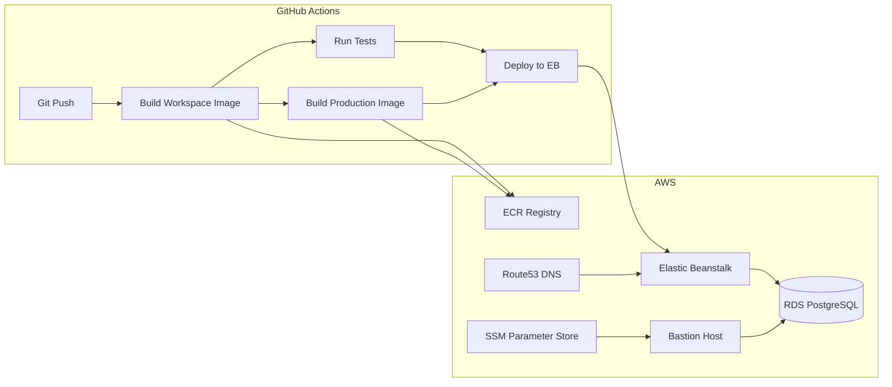

# Deployment

## Overview

The application is deployed to **AWS Elastic Beanstalk** using Docker containers. Infrastructure is managed with **Terraform** (state in Terraform Cloud), and CI/CD is handled by **GitHub Actions**.



---

## Environments

| Branch | Environment | Domain Pattern |
|--------|-------------|----------------|
| `main` | Development | `evolusea-backend-development-api.evolusea.com` |
| `staging` | Staging | `evolusea-backend-staging-api.evolusea.com` |
| `production` | Production | `evolusea-backend-production-api.evolusea.com` |

Deployments are triggered automatically when pushing to one of these branches.

---

## CI/CD Pipeline

### Workflow: `main.yaml`

The primary pipeline runs on push to `main`, `staging`, or `production` branches, and on pull requests.

#### Jobs

1. **`prepare_envs`** -- Determines the target environment from the branch name and generates ECR image tags.

2. **`build_workspace_image`** -- Builds the workspace Docker image (development stage) and pushes to ECR. This image is used for running tests.

3. **`tests`** -- Calls the reusable `tests.yaml` workflow:
   - **Unit tests** -- Runs `yarn test` inside the workspace image
   - **E2E tests** -- Runs `yarn test:e2e` with Testcontainers
   - **Smoke tests (localhost)** -- Starts the full stack via Docker Compose, waits for health, runs `yarn test:smoke-tests`

4. **`build_final_image`** -- Builds the production Docker image (production stage) and pushes to ECR.

5. **`test_final_image`** -- Runs smoke tests against the production image using `compose-prod.yml`.

6. **`deploy`** -- Calls the reusable `deploy.yaml` workflow (only on push to main/staging/production, not on PRs).

### Workflow: `deploy.yaml`

Reusable deployment workflow:

1. Configures AWS credentials
2. Installs the Elastic Beanstalk CLI
3. Runs `scripts/deploy.sh` with the ECR image tag, environment name, and region
4. Waits 1 minute for deployment to propagate
5. Verifies deployment via `scripts/verify-deployment.sh` (checks `/health` endpoint)

### Workflow: `tests.yaml`

Reusable testing workflow that receives the workspace image tag and runs all three test tiers in parallel.

---

## Docker Images

### Multi-Stage Dockerfile

The Dockerfile has two stages:

#### Stage 1: `workspace` (Development)

- **Base**: `node:22.17-bullseye-slim`
- **Includes**: NestJS CLI, Terraform 1.5.7, AWS CLI v2, SSM Plugin, Sentry CLI, socat
- **Purpose**: Development environment, test runner, infrastructure management
- **Entry**: `development-entrypoint.sh`

#### Stage 2: `production`

- **Base**: `node:22.17-alpine3.21`
- **Includes**: Production dependencies only, compiled `dist/`, PM2
- **Environment**: `NODE_ENV=production`
- **Port**: 3000
- **Entry**: `entrypoint.sh` (runs migrations, then starts the app via PM2)
- **Health check**: `wget --no-verbose --tries=1 --spider http://localhost:3000/health`

### ECR Registry

Images are pushed to Amazon ECR:

- **Registry**: `089117447164.dkr.ecr.ap-southeast-7.amazonaws.com`
- **Repository**: `evolusea-backend-ecr-repository`
- **Region**: `ap-southeast-7` (Thailand)

---

## Deployment Scripts

### `scripts/deploy.sh`

Deploys to AWS Elastic Beanstalk:

```bash
./scripts/deploy.sh -e <environment> -r <region> -n <app-name> -t <ecr-image-tag>
```

Actions:
1. Generates `Dockerrun.aws.json` with the ECR image reference and port 3000
2. Creates `.elasticbeanstalk/config.yml` with the app name, Docker platform, and region
3. Runs `eb deploy` with a versioned deployment label

### `scripts/verify-deployment.sh`

Verifies the deployment health:

```bash
./scripts/verify-deployment.sh
```

Checks the `$DOMAIN_AND_PORT/health` endpoint for an HTTP 200 response.

### `scripts/wait-for-healthy.sh`

Waits for a Docker container to become healthy:

```bash
./scripts/wait-for-healthy.sh <image-tag> [service-name] [timeout-seconds]
```

Polls container health status every 10 seconds with a configurable timeout (default: 120s).

### `scripts/start_ssm.sh`

Sets up AWS SSM port forwarding to reach the RDS database through a bastion host:

```bash
./scripts/start_ssm.sh [environment]
```

- Finds the bastion host EC2 instance by tag
- Gets the RDS endpoint
- Forwards local port 5433 to the RDS database

### `scripts/tf_login.sh`

Configures Terraform Cloud credentials from the `TERRAFORM_CLOUD_TOKEN` environment variable.

---

## Infrastructure (Terraform)

Infrastructure is defined in `terraform/` and managed via Terraform Cloud.

### Shared Infrastructure (`terraform/shared/`)

Resources shared across all environments:

- **AWS Elastic Beanstalk Application** -- The EB application container
- **AWS ECR Repository** -- Docker image registry
- **CI/CD IAM User** -- Service account for GitHub Actions

### Environment Infrastructure (`terraform/environments/`)

Per-environment resources (development, staging, production):

- **AWS Elastic Beanstalk Environment** -- Environment with Docker platform
- **EC2 Instance Profile and IAM Role** -- For EB instances
- **ECR Access Policy** -- Allows EB instances to pull images
- **SSL Certificate** -- AWS-issued certificate for the environment subdomain
- **RDS PostgreSQL Instance** -- Managed database
- **Bastion Host** -- For secure database access via SSM

### Setting Up a New Environment

1. Navigate to `terraform/environments/`
2. Create a Terraform workspace: `terraform workspace new <env_name>`
3. In Terraform Cloud, configure:
   - `AWS_ACCESS_KEY_ID` and `AWS_SECRET_ACCESS_KEY` (sensitive)
   - `env_name` variable
   - `sentry_dsn` variable
   - `rds_password` variable (sensitive)
4. Enable remote state sharing from the shared workspace
5. Run `terraform apply`

### DNS and SSL

- **Base domain**: `evolusea.com` (registered in AWS Route53)
- **Pattern**: `<app-name>-<env-name>-api.evolusea.com`
- **SSL**: AWS-issued certificates, HTTPS only (port 443)
- **HTTP**: Port 80 listener is disabled by default

---

## Monitoring

### Sentry

Runtime error tracking across all environments.

- **DSN**: Set via `SENTRY_DSN` environment variable
- **Traces**: Sampled at 5% (`tracesSampleRate: 0.05`)
- **Ignored paths**: Swagger UI and health check endpoints
- **Releases**: Tagged with `SENTRY_RELEASE` for version tracking
- **Source maps**: Uploaded via Sentry CLI during build

### Loggly (Winston)

Cloud-based log aggregation:

- **Transport**: Winston `winston-loggly-bulk` transport
- **Log level**: `debug` (configurable)
- **Tags**: Environment-specific tagging

### Health Check

The `/health` endpoint returns a 200 status when the application is running. It is used by:

- Elastic Beanstalk health monitoring
- Deployment verification scripts
- Smoke tests
- Docker container health checks

---

## Required CI/CD Secrets

The following secrets must be configured in GitHub repository settings:

| Secret | Description |
|--------|-------------|
| `AWS_ACCESS_KEY_ID` | AWS access key for ECR and EB operations |
| `AWS_SECRET_ACCESS_KEY` | AWS secret key |

Additional variables used in the workflow (configured as env vars in `main.yaml`):

| Variable | Value |
|----------|-------|
| `ECR_REGISTRY` | `089117447164.dkr.ecr.ap-southeast-7.amazonaws.com` |
| `ECR_REPOSITORY` | `evolusea-backend-ecr-repository` |
| `AWS_DEFAULT_REGION` | `ap-southeast-7` |
| `APP_NAME` | `evolusea-backend` |
| `APP_DOMAIN` | `evolusea.com` |
