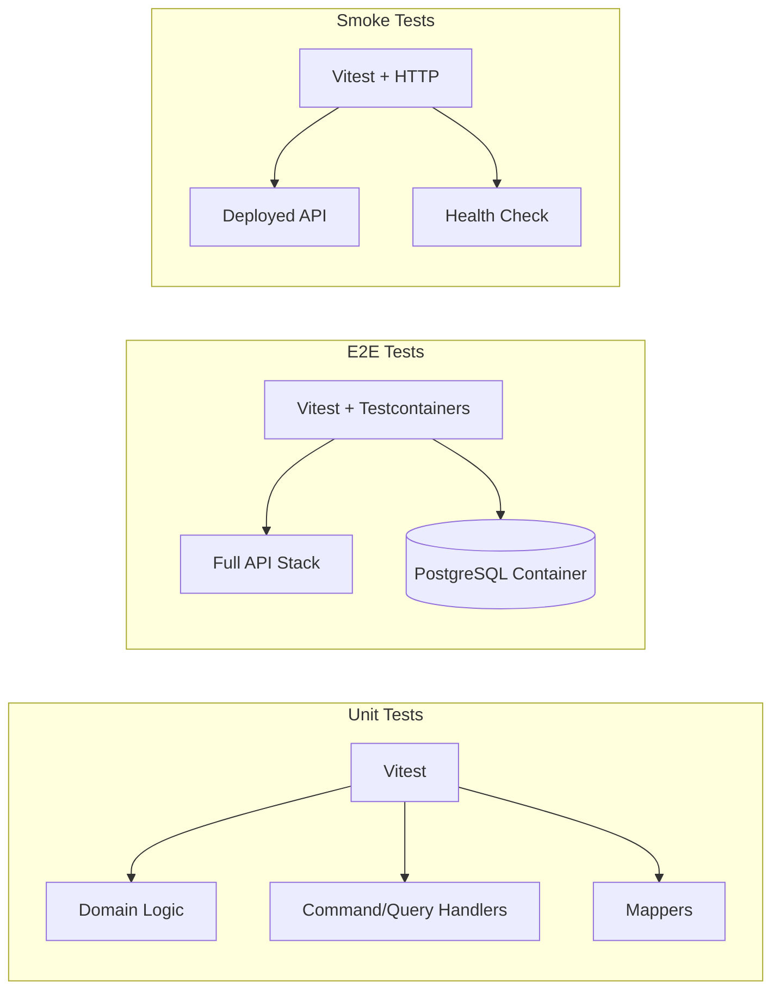
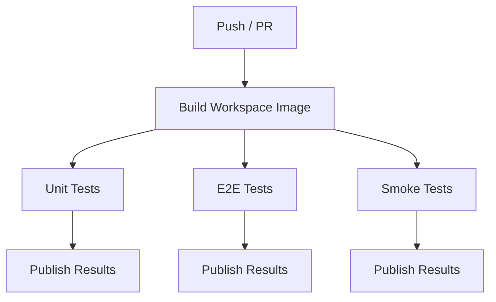

# Testing

The project uses **Vitest** as the test runner across all test types. Tests are organized into three tiers: unit tests, end-to-end (E2E) tests, and smoke tests.

## Test Strategy Overview



| Tier | Runner | Database | Scope | Command |
|------|--------|----------|-------|---------|
| Unit | Vitest | None (mocked) | Individual classes and functions | `yarn test` |
| E2E | Vitest + Testcontainers | Real PostgreSQL container | Full HTTP request/response cycle | `yarn test:e2e` |
| Smoke | Vitest + HTTP | Production database | Health and basic connectivity | `yarn test:smoke-tests` |

---

## Unit Tests

Unit tests live alongside the source code in `src/` and use the `.spec.ts` suffix.

### Running

```bash
# Run all unit tests
yarn test

# Watch mode
yarn test:watch

# With coverage report
yarn test:cov

# Debug mode
yarn test:debug
```

### Configuration

Unit tests use the default Vitest configuration from the project root. The SWC compiler is used for fast TypeScript compilation via `unplugin-swc`.

### Writing Unit Tests

Unit tests focus on domain logic, command/query handlers, and mappers. External dependencies are mocked.

```typescript
import { describe, it, expect } from 'vitest';

describe('MyCommandHandler', () => {
  it('should do something', async () => {
    // Arrange
    const handler = new MyCommandHandler(mockRepo);
    
    // Act
    const result = await handler.handle(command);
    
    // Assert
    expect(result).toBeDefined();
  });
});
```

---

## End-to-End (E2E) Tests

E2E tests are located in the `test/` directory and exercise the full application stack with a real PostgreSQL database.

### Running

```bash
# Run E2E tests (requires Docker)
yarn test:e2e

# Verbose output
yarn test:e2e:verbose
```

Testcontainers requires Docker to be running, as it spins up a PostgreSQL container for each test suite.

### Configuration

E2E tests use a dedicated Vitest config: `test/vitest.config.e2e.mts`

The `TESTCONTAINERS_RYUK_DISABLED=true` flag is set to prevent Testcontainers' resource reaper from interfering (useful in CI environments).

### Test Infrastructure

The E2E test infrastructure is in `test/sut/` (System Under Test):

#### AppContainersFactory (`test/sut/app-containers/`)

Manages test containers:

- **`AppContainersFactory`** -- Factory for creating and managing containers
- **`DatabaseContainer`** -- Handles PostgreSQL container lifecycle:
  - Starts a fresh PostgreSQL 16 container
  - Runs all migrations automatically
  - Provides connection details to the test app
  - Cleans up after tests

#### TestAppFactory (`test/sut/test-app/`)

Bootstraps a test instance of the NestJS application:

- **`TestAppFactory`** -- Creates a configured test application:
  - Overrides providers with test doubles (e.g., fake Firebase auth)
  - Connects to the Testcontainers database
  - Provides the NestJS INestApplication instance

- **`TestApp`** -- Wrapper providing test helpers:
  - HTTP request helpers (GET, POST, PUT, DELETE) via Supertest
  - Authenticated request helpers (pre-configured with test user tokens)
  - Provider access for direct service interaction

#### Test Doubles (`test/sut/test-app/doublers/`)

Fakes and mocks for external dependencies:

- **Firebase Auth** -- Fake authentication provider that bypasses real Firebase
- **AI Services** -- Fake AI facade with mockable responses
- **Notification Provider** -- Fake notification service

### Test Suite Setup

The `create-test-suite.ts` helper provides lifecycle management:

```typescript
const { testApp, dbContainer } = createTestSuite();

describe('My Feature', () => {
  it('should work end-to-end', async () => {
    const response = await testApp.get('/users/me/notes');
    expect(response.status).toBe(200);
  });
});
```

This automatically:
1. Starts a PostgreSQL container before all tests
2. Bootstraps the NestJS application
3. Runs migrations
4. Tears down everything after all tests

---

## Smoke Tests

Smoke tests validate that a deployed (or locally running) instance is healthy and responding.

### Running

```bash
# Against local Docker environment
docker compose exec -e URL_BASE=http://workspace:3000 workspace yarn run test:smoke-tests

# Against a remote deployment
URL_BASE=https://api.example.com yarn test:smoke-tests
```

### Configuration

Smoke tests use `smoke-tests/vitest.config.smoke-tests.mts` and read the `URL_BASE` environment variable to determine the target API.

### What They Test

- Health check endpoint responds with 200
- Basic API connectivity
- Essential endpoint availability

---

## CI/CD Test Pipeline

Tests run automatically in the GitHub Actions CI pipeline (`.github/workflows/tests.yaml`):



1. **Unit Tests** -- Run inside the workspace Docker image
2. **E2E Tests** -- Run inside the workspace Docker image with Docker-in-Docker for Testcontainers
3. **Smoke Tests** -- Start the full stack via Docker Compose, wait for health check, then run

Test results are published as GitHub Actions artifacts for review.

---

## Test Coverage

Generate a coverage report:

```bash
yarn test:cov
```

Coverage is collected for unit tests. E2E tests do not generate coverage reports by default.

---

## Tips

- **Speeding up E2E tests**: Tests share a single database container per suite. Use `createTestSuite()` for proper lifecycle management.
- **Debugging tests**: Use `yarn test:debug` for unit tests. For E2E, attach a debugger to the test process.
- **Docker requirement**: E2E tests always require Docker. Ensure the Docker daemon is running before executing `yarn test:e2e`.
- **Pre-commit hook**: The project runs `yarn lint` as a pre-commit hook to catch issues early.
